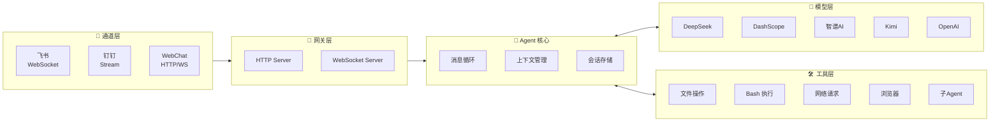
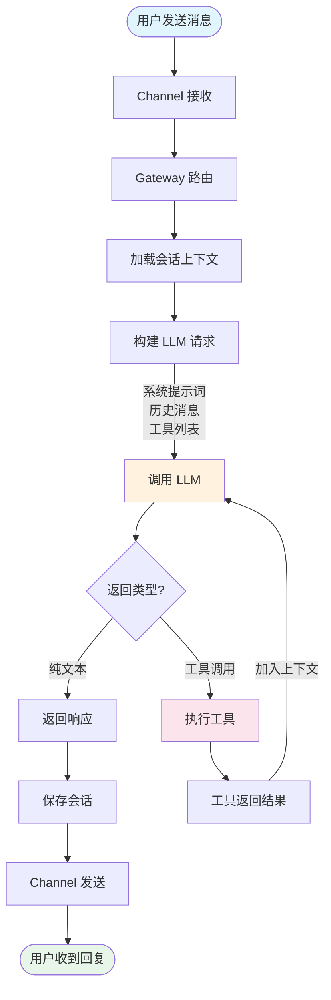

# Mozi (墨子)

**支持国产大模型和国产通讯软件的智能助手框架**

Mozi 是一个轻量级的 AI 助手框架，专注于国产生态。它提供统一的接口对接多种国产 AI 模型（DeepSeek、Qwen、Kimi 等），支持 OpenAI Function Calling，并能在飞书、钉钉等平台上运行。

## 核心特性

- **多模型支持** — DeepSeek、DashScope (Qwen)、智谱AI、Kimi、阶跃星辰、MiniMax，以及 OpenAI/Anthropic 兼容格式
- **多平台通道** — 飞书、钉钉，统一的消息处理接口
- **Function Calling** — 原生支持 OpenAI tools/tool_choice 参数
- **17 内置工具** — 文件读写、Bash 执行、代码搜索、网页获取、图像分析、浏览器自动化等
- **会话管理** — 上下文压缩、会话持久化、多轮对话
- **可扩展** — 插件系统、Hook 事件、自定义工具、子 Agent

## 为什么选择 Mozi？

Mozi 的架构设计参考了 [Moltbot](https://github.com/moltbot/moltbot)，但专注于不同的使用场景：

| 特性 | Mozi | Moltbot |
|------|------|---------|
| **定位** | 国产生态优先的轻量框架 | 全功能个人 AI 助手 |
| **代码量** | ~16,000 行 (64 文件) | ~516,000 行 (3,137 文件) |
| **国产模型** | DeepSeek、Qwen、Kimi 等 7+ 家 | 仅 Anthropic、OpenAI |
| **国产通讯** | 飞书、钉钉原生支持 | WhatsApp、Telegram、Slack 等 |
| **Node.js 版本** | >= 18 | >= 22 |
| **适用场景** | 企业内部机器人、国内团队协作 | 个人多设备助手、海外平台集成 |

> **Mozi 用 3% 的代码量实现了核心功能**，专注简洁高效，易于理解和二次开发。

## 架构设计



### 消息处理流程



### 核心模块

| 模块 | 目录 | 职责 |
|------|------|------|
| **Agent** | `src/agents/` | 核心消息循环、上下文压缩、会话管理、模型失败重试 |
| **Providers** | `src/providers/` | 统一的模型调用接口，支持 OpenAI/Anthropic 兼容格式 |
| **Tools** | `src/tools/` | 工具注册、参数校验、执行引擎，支持自定义扩展 |
| **Channels** | `src/channels/` | 通道适配器，统一消息格式，支持长连接和 Webhook |
| **Sessions** | `src/sessions/` | 会话持久化，支持内存/文件存储，Transcript 记录 |
| **Gateway** | `src/gateway/` | HTTP/WebSocket 服务，路由分发 |

### 上下文压缩策略

当对话历史超过 Token 限制时，Mozi 使用智能压缩：

1. **保留策略** — 始终保留系统提示词和最近 N 轮对话
2. **摘要压缩** — 将早期对话压缩为摘要，保留关键信息
3. **工具结果裁剪** — 截断过长的工具返回结果
4. **配对验证** — 确保 tool_call 和 tool_result 成对出现

## 快速开始

### 环境要求

- Node.js >= 18
- npm / pnpm / yarn

### 1. 安装

```bash
# 全局安装（推荐）
npm install -g mozi-bot

# 或者克隆项目开发
git clone https://github.com/King-Chau/mozi.git
cd mozi && npm install && npm run build
```

### 2. 配置

运行配置向导（推荐）：

```bash
mozi onboard
```

向导会引导你完成以下配置：
- **国产模型** — DeepSeek、智谱AI、DashScope、Kimi、阶跃星辰、MiniMax、ModelScope
- **自定义 OpenAI 兼容接口** — 支持任意 OpenAI API 格式的服务（如 vLLM、Ollama）
- **自定义 Anthropic 兼容接口** — 支持任意 Claude API 格式的服务
- **通讯平台** — 飞书、钉钉

配置文件将保存到 `~/.mozi/config.local.json5`。

也可以直接使用环境变量（快速体验）：

```bash
export DEEPSEEK_API_KEY=sk-your-key
```

### 3. 启动

```bash
# 仅 WebChat（无需配置飞书/钉钉）
mozi start --web-only

# 完整服务（WebChat + 飞书 + 钉钉）
mozi start

# 克隆项目方式
npm start -- start --web-only
```

打开浏览器访问 `http://localhost:3000` 即可开始对话。

## 支持的模型提供商

### 国产模型

| 提供商 | 环境变量 | 说明 |
|--------|----------|------|
| DeepSeek | `DEEPSEEK_API_KEY` | 推理能力强、性价比高 |
| DashScope | `DASHSCOPE_API_KEY` | 阿里云灵积，通义千问商业版，稳定高并发 |
| 智谱 AI | `ZHIPU_API_KEY` | GLM-4 系列，清华技术团队，有免费额度 |
| ModelScope | `MODELSCOPE_API_KEY` | 阿里云魔搭社区，Qwen 开源版，有免费额度 |
| Kimi | `KIMI_API_KEY` | Moonshot，长上下文支持（128K/1M） |
| 阶跃星辰 | `STEPFUN_API_KEY` | Step 系列，多模态能力 |
| MiniMax | `MINIMAX_API_KEY` | 语音、视觉能力 |

### 海外模型

| 提供商 | 环境变量 | 说明 |
|--------|----------|------|
| OpenAI | `OPENAI_API_KEY` | GPT-4o、GPT-4、GPT-3.5 |
| OpenRouter | `OPENROUTER_API_KEY` | 聚合多家模型，统一 API |
| Together AI | `TOGETHER_API_KEY` | 开源模型托管，Llama、Mixtral 等 |
| Groq | `GROQ_API_KEY` | 超快推理速度 |

### 本地部署

| 提供商 | 环境变量 | 说明 |
|--------|----------|------|
| Ollama | `OLLAMA_BASE_URL` | 本地运行开源模型 |

### 自定义接口

支持配置任意 OpenAI 或 Anthropic 兼容的 API 接口。通过 `mozi onboard` 向导配置，或手动添加到配置文件：

```json5
{
  providers: {
    // 自定义 OpenAI 兼容接口（如 vLLM、LiteLLM 等）
    "custom-openai": {
      id: "my-provider",
      name: "My Provider",
      baseUrl: "https://api.example.com/v1",
      apiKey: "xxx",
      models: [
        {
          id: "model-id",
          name: "Model Name",
          contextWindow: 32768,
          maxTokens: 4096,
          supportsVision: false,
          supportsTools: true
        }
      ]
    },

    // 自定义 Anthropic 兼容接口
    "custom-anthropic": {
      id: "my-anthropic",
      name: "My Anthropic",
      baseUrl: "https://api.example.com",
      apiKey: "xxx",
      apiVersion: "2023-06-01",
      models: [
        {
          id: "claude-3-5-sonnet",
          name: "Claude 3.5 Sonnet",
          contextWindow: 200000,
          maxTokens: 8192
        }
      ]
    }
  }
}
```

## 通讯平台接入

飞书和钉钉都支持两种连接模式：

| 模式 | 说明 | 适用场景 |
|------|------|----------|
| **长连接（默认）** | WebSocket/Stream 主动连接，无需公网 IP | 内网部署、本地开发 |
| Webhook | 被动接收回调，需要公网可访问地址 | 公网服务器部署 |

> **推荐使用长连接模式**：无需公网 IP，无需配置回调地址，启动即可接收消息。

### 飞书

1. 登录 [飞书开放平台](https://open.feishu.cn/)，创建企业自建应用
2. 获取 App ID 和 App Secret
3. 启用「机器人」能力
4. 添加权限：`im:message`、`im:message.group_at_msg`
5. 进入「事件订阅」，将订阅方式设置为「使用长连接接收事件」
6. 添加事件：`im.message.receive_v1`（接收消息）
7. 配置完成，启动服务即可

```json5
{
  channels: {
    feishu: {
      appId: "cli_xxx",
      appSecret: "xxx",
      mode: "websocket"  // 默认值，可省略
    }
  }
}
```

> Webhook 模式：将步骤 5 的订阅方式改为 HTTP，配置回调地址为 `http://your-server:3000/webhook/feishu`，并设置 `mode: "webhook"`。

### 钉钉

1. 登录 [钉钉开放平台](https://open.dingtalk.com/)，创建企业内部应用
2. 获取 AppKey 和 AppSecret
3. 添加「机器人」能力
4. 在机器人配置页面，消息接收模式选择「Stream 模式」
5. 配置完成，启动服务即可

```json5
{
  channels: {
    dingtalk: {
      appKey: "xxx",
      appSecret: "xxx",
      mode: "stream"  // 默认值，可省略
    }
  }
}
```

> Webhook 模式：将步骤 4 改为 HTTP 模式，配置消息接收地址为 `http://your-server:3000/webhook/dingtalk`，并设置 `mode: "webhook"`。

## 配置参考

配置文件支持 `config.local.json5`、`config.json5`、`config.yaml` 等格式，优先级从高到低。存放在 `~/.mozi/` 目录下。

<details>
<summary>完整配置示例</summary>

```json5
{
  // 模型提供商
  providers: {
    deepseek: {
      apiKey: "sk-xxx"
    },
    dashscope: {
      apiKey: "sk-xxx",
      // 可选：自定义模型列表（覆盖预设）
      models: [
        {
          id: "qwen-max-latest",
          name: "通义千问 Max",
          contextWindow: 32768,
          maxTokens: 8192
        }
      ]
    },
    zhipu: {
      apiKey: "xxx"
    },
    modelscope: {
      apiKey: "ms-xxx"
    }
  },

  // 通讯平台（长连接模式，无需公网）
  channels: {
    feishu: {
      appId: "cli_xxx",
      appSecret: "xxx"
    },
    dingtalk: {
      appKey: "xxx",
      appSecret: "xxx"
    }
  },

  // Agent 配置
  agent: {
    defaultProvider: "deepseek",
    defaultModel: "deepseek-chat",
    temperature: 0.7,
    maxTokens: 4096,
    systemPrompt: "你是墨子，一个智能助手。"
  },

  // 服务器配置
  server: {
    port: 3000,
    host: "0.0.0.0"
  },

  // 日志级别
  logging: {
    level: "info"  // debug | info | warn | error
  }
}
```

</details>

## 内置工具

| 类别 | 工具 | 说明 |
|------|------|------|
| 文件 | `read_file` | 读取文件内容 |
| | `write_file` | 写入/创建文件 |
| | `edit_file` | 精确字符串替换 |
| | `list_directory` | 列出目录内容 |
| | `glob` | 按模式搜索文件 |
| | `grep` | 按内容搜索文件 |
| | `apply_patch` | 应用 diff 补丁 |
| 命令 | `bash` | 执行 Bash 命令 |
| | `process` | 管理后台进程 |
| 网络 | `web_search` | 网络搜索 |
| | `web_fetch` | 获取网页内容 |
| 多媒体 | `image_analyze` | 图像分析（需要视觉模型） |
| | `browser` | 浏览器自动化（需安装 Playwright） |
| 系统 | `current_time` | 获取当前时间 |
| | `calculator` | 数学计算 |
| | `delay` | 延时等待 |
| Agent | `subagent` | 创建子 Agent 执行复杂任务 |

## CLI 命令

```bash
# 配置
mozi onboard            # 配置向导（支持国产模型/自定义接口）
mozi check              # 检查配置
mozi models             # 列出可用模型

# 启动服务
mozi start              # 完整服务（含飞书/钉钉）
mozi start --web-only   # 仅 WebChat
mozi start --port 8080  # 指定端口

# 聊天
mozi chat               # 命令行聊天

# 日志
mozi logs               # 查看最新日志（默认 50 行）
mozi logs -n 100        # 查看最新 100 行
mozi logs -f            # 实时跟踪日志（类似 tail -f）
mozi logs --level error # 只显示错误日志
```

> 日志文件存储在 `~/.mozi/logs/` 目录下，按日期自动轮转。

## 项目结构

```
src/
├── agents/        # Agent 核心（消息循环、上下文压缩、会话管理）
├── channels/      # 通道适配器（飞书、钉钉）
├── providers/     # 模型提供商（统一接口）
├── tools/         # 内置工具（文件、Bash、网络等）
├── sessions/      # 会话存储（内存、文件）
├── web/           # WebChat 前端
├── config/        # 配置加载
├── gateway/       # HTTP/WebSocket 网关
├── cli/           # CLI 命令行工具
├── hooks/         # Hook 事件系统
├── utils/         # 工具函数
└── types/         # TypeScript 类型定义
```

## API 使用

```typescript
import { loadConfig, initializeProviders, getProvider } from "mozi-bot";

const config = loadConfig();
initializeProviders(config);

const provider = getProvider("deepseek");
const response = await provider.chat({
  model: "deepseek-chat",
  messages: [{ role: "user", content: "你好！" }],
});

console.log(response.content);
```

## 开发

```bash
# 开发模式（自动重启）
npm run dev -- start --web-only

# 构建
npm run build

# 测试
npm test
```

## 学习 Agent 原理

如果你想了解 AI Agent 的工作原理，Mozi 是一个很好的学习项目。相比动辄几十万行代码的大型框架，Mozi 只有约 16,000 行代码，但实现了完整的 Agent 核心功能：

- **消息循环** — 用户输入 → LLM 推理 → 工具调用 → 结果反馈
- **上下文管理** — 会话历史、Token 压缩、多轮对话
- **工具系统** — 函数定义、参数校验、结果处理
- **流式输出** — SSE/WebSocket 实时响应
- **失败重试** — 模型调用失败自动切换备选模型

代码结构清晰，注释完善，适合阅读源码学习 Agent 架构设计。

## Star History

[](https://star-history.com/#King-Chau/mozi&Date)

## License

Apache 2.0
