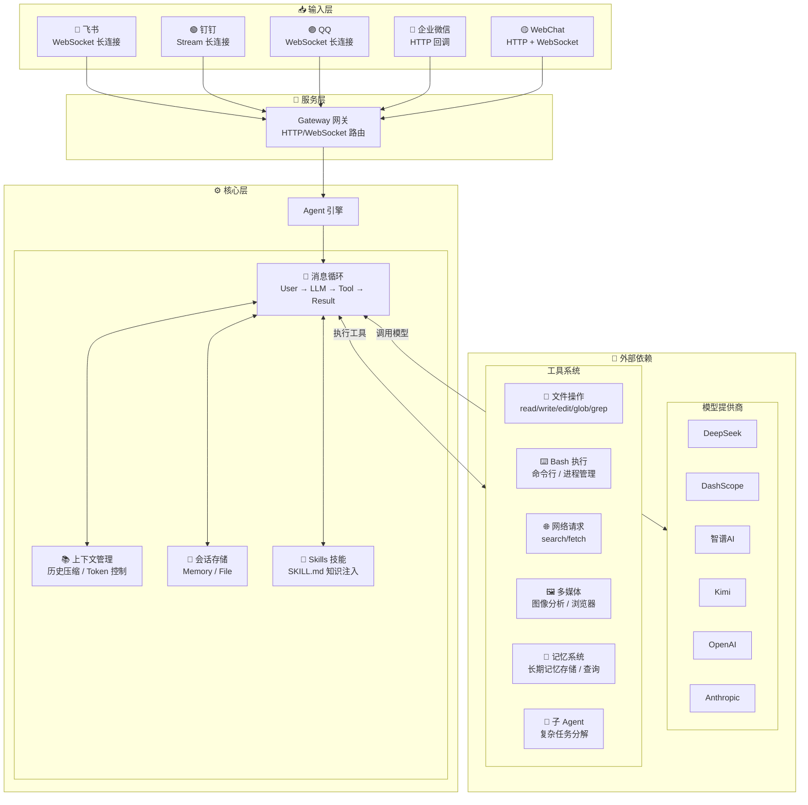
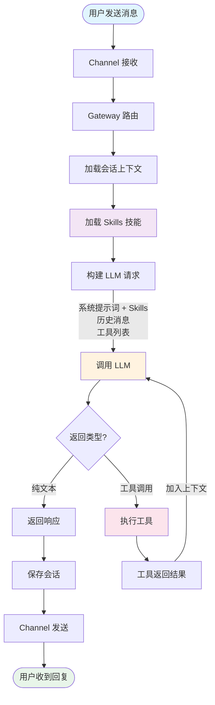

# Mozi (墨子)

<p align="center">
  
  
</p>

**支持国产大模型和国产通讯软件的智能助手框架**

Mozi 是一个轻量级的 AI 助手框架，专注于国产生态。它提供统一的接口对接多种国产 AI 模型（DeepSeek、Qwen、Kimi 等），支持 OpenAI Function Calling，并支持 QQ、飞书、钉钉、企业微信等通讯平台。

## 核心特性

- **多模型支持** — DeepSeek、DashScope (Qwen)、智谱AI、Kimi、阶跃星辰、MiniMax，以及 OpenAI/Anthropic 兼容格式
- **多平台通道** — QQ、飞书、钉钉、企业微信，统一的消息处理接口
- **Function Calling** — 原生支持 OpenAI tools/tool_choice 参数
- **20 内置工具** — 文件读写、Bash 执行、代码搜索、网页获取、图像分析、浏览器自动化、记忆系统等
- **Skills 技能系统** — 通过 SKILL.md 文件扩展 Agent 能力，支持自定义行为和专业知识注入
- **记忆系统** — 跨会话长期记忆，自动记住用户偏好和重要信息
- **会话管理** — 上下文压缩、会话持久化、多轮对话
- **可扩展** — 插件系统、Hook 事件、自定义工具、子 Agent

## 为什么选择 Mozi？

Mozi 的架构设计参考了 [Moltbot](https://github.com/moltbot/moltbot)，但专注于不同的使用场景：

| 特性 | Mozi | Moltbot |
|------|------|---------|
| **定位** | 国产生态优先的轻量框架 | 全功能个人 AI 助手 |
| **代码量** | ~16,000 行 (64 文件) | ~516,000 行 (3,137 文件) |
| **国产通讯** | QQ、飞书、钉钉、企业微信原生支持 | WhatsApp、Telegram、Slack 等 |
| **Node.js 版本** | >= 18 | >= 22 |
| **适用场景** | 企业内部机器人、国内团队协作 | 个人多设备助手、海外平台集成 |

> **Mozi 用 3% 的代码量实现了核心功能**，专注简洁高效，易于理解和二次开发。

## 快速开始

### 环境要求

- Node.js >= 18
- npm / pnpm / yarn
- **跨平台支持**：macOS、Linux、Windows

### 1. 安装

```bash
# 全局安装（推荐）
npm install -g mozi-bot

# 或者克隆项目开发
git clone https://github.com/King-Chau/mozi.git
cd mozi && npm install && npm run build
```

### 2. 配置

运行配置向导（推荐）：

```bash
mozi onboard
```

向导会引导你完成以下配置：
- **国产模型** — DeepSeek、智谱AI、DashScope、Kimi、阶跃星辰、MiniMax、ModelScope
- **自定义 OpenAI 兼容接口** — 支持任意 OpenAI API 格式的服务（如 vLLM、Ollama）
- **自定义 Anthropic 兼容接口** — 支持任意 Claude API 格式的服务
- **通讯平台** — QQ、飞书、钉钉、企业微信
- **记忆系统** — 启用/禁用长期记忆、自定义存储目录

配置文件将保存到 `~/.mozi/config.local.json5`。

也可以直接使用环境变量（快速体验）：

```bash
export DEEPSEEK_API_KEY=sk-your-key
```

### 3. 启动

```bash
# 仅 WebChat（无需配置 QQ/飞书/钉钉）
mozi start --web-only

# 完整服务（WebChat + QQ + 飞书 + 钉钉）
mozi start

# 克隆项目方式
npm start -- start --web-only
```

打开浏览器访问 `http://localhost:3000` 即可开始对话。

## 支持的模型提供商

### 国产模型

| 提供商 | 环境变量 | 说明 |
|--------|----------|------|
| DeepSeek | `DEEPSEEK_API_KEY` | 推理能力强、性价比高 |
| DashScope | `DASHSCOPE_API_KEY` | 阿里云灵积，通义千问商业版，稳定高并发 |
| 智谱 AI | `ZHIPU_API_KEY` | GLM-Z1/GLM-4 系列，清华技术团队，有免费额度 |
| ModelScope | `MODELSCOPE_API_KEY` | 阿里云魔搭社区，Qwen 开源版，有免费额度 |
| Kimi | `KIMI_API_KEY` | Kimi K2.5/Moonshot 系列，长上下文支持 |
| 阶跃星辰 | `STEPFUN_API_KEY` | Step-2/Step-1 系列，推理与多模态 |
| MiniMax | `MINIMAX_API_KEY` | MiniMax M2.1 系列，推理能力强 |

### 海外模型

| 提供商 | 环境变量 | 说明 |
|--------|----------|------|
| OpenAI | `OPENAI_API_KEY` | GPT-4o、GPT-4、GPT-3.5 |
| OpenRouter | `OPENROUTER_API_KEY` | 聚合多家模型，统一 API |
| Together AI | `TOGETHER_API_KEY` | 开源模型托管，Llama、Mixtral 等 |
| Groq | `GROQ_API_KEY` | 超快推理速度 |

### 本地部署

| 提供商 | 环境变量 | 说明 |
|--------|----------|------|
| Ollama | `OLLAMA_BASE_URL` | 本地运行开源模型 |

### 自定义接口

支持配置任意 OpenAI 或 Anthropic 兼容的 API 接口。通过 `mozi onboard` 向导配置，或手动添加到配置文件：

```json5
{
  providers: {
    // 自定义 OpenAI 兼容接口（如 vLLM、LiteLLM 等）
    "custom-openai": {
      id: "my-provider",
      name: "My Provider",
      baseUrl: "https://api.example.com/v1",
      apiKey: "xxx",
      models: [
        {
          id: "model-id",
          name: "Model Name",
          contextWindow: 32768,
          maxTokens: 4096,
          supportsVision: false,
          supportsTools: true
        }
      ]
    },

    // 自定义 Anthropic 兼容接口
    "custom-anthropic": {
      id: "my-anthropic",
      name: "My Anthropic",
      baseUrl: "https://api.example.com",
      apiKey: "xxx",
      apiVersion: "2023-06-01",
      models: [
        {
          id: "claude-3-5-sonnet",
          name: "Claude 3.5 Sonnet",
          contextWindow: 200000,
          maxTokens: 8192
        }
      ]
    }
  }
}
```

## 通讯平台接入

QQ、飞书和钉钉都支持长连接模式，企业微信使用 Webhook 回调模式：

| 模式 | 说明 | 适用场景 | 平台 |
|------|------|----------|------|
| **长连接** | WebSocket/Stream 主动连接，无需公网 IP | 内网部署、本地开发 | QQ、飞书、钉钉 |
| Webhook | 被动接收回调，需要公网可访问地址 | 公网服务器部署 | 企业微信 |

> **长连接模式**：无需公网 IP，无需配置回调地址，启动即可接收消息。

### 飞书

#### 1. 创建应用

1. 登录 [飞书开放平台](https://open.feishu.cn/)，创建企业自建应用
2. 获取 App ID 和 App Secret
3. 在应用管理页左侧导航栏，找到「应用能力」，启用「机器人」能力

#### 2. 事件配置

1. 在应用管理页左侧导航栏，找到「事件与回调」，点击进入
2. 订阅方式选择「长连接」，点击「保存」
   > ⚠️ 如果提示"未建立长连接"，需要先完成「Mozi 配置」并启动服务（`mozi start`），再回来保存长连接
3. 点击「添加事件」，在弹出列表中选择「消息与群组」分类，勾选「接收消息」（`im.message.receive_v1`），点击「确定」

#### 3. 权限配置

1. 在应用管理页左侧导航栏，找到「权限管理」，点击进入
2. 点击「批量导入权限」按钮，将以下 JSON 粘贴到输入框中，点击「导入」：

```json
{
  "scopes": {
    "tenant": [
      "contact:user.base:readonly",
      "im:chat",
      "im:chat:read",
      "im:chat:update",
      "im:message",
      "im:message.group_at_msg:readonly",
      "im:message.p2p_msg:readonly",
      "im:message:send_as_bot",
      "im:resource"
    ],
    "user": []
  }
}
```

3. 页面显示「导入成功」即为完成

#### 4. 发布应用

1. 在应用管理页左侧导航栏，找到「版本管理与发布」
2. 点击右上角「新建版本」，填写版本号与描述
3. 保存并发布，等待审核通过

#### 5. Mozi 配置

```json5
{
  channels: {
    feishu: {
      appId: "cli_xxx",
      appSecret: "xxx"
    }
  }
}
```

### 钉钉

#### 1. 创建应用

1. 前往 [钉钉开放平台](https://open-dev.dingtalk.com/fe/app)（需管理员权限）
2. 点击「创建应用」，选择「机器人」类型
3. 填写应用名称等必要信息，完成创建

#### 2. 获取凭证

1. 在应用详情页面，点击「凭证与基础信息」
2. 保存 **Client ID** 和 **Client Secret**

#### 3. 发布应用

1. 点击「版本管理与发布」，点击「创建新版本」
2. 填写版本描述，点击「保存」
3. 点击「发布」，在弹窗中确认发布

#### 4. 配置环境变量

```bash
export DINGTALK_APP_KEY=your_client_id
export DINGTALK_APP_SECRET=your_client_secret
```

或使用配置文件：

```json5
{
  channels: {
    dingtalk: {
      appKey: "your_client_id",
      appSecret: "your_client_secret"
    }
  }
}
```

#### 5. 启动并测试

```bash
mozi start
```

在钉钉中搜索机器人名称，发送消息测试。

### QQ

#### 1. 注册并创建应用

1. 访问 [QQ 开放平台](https://q.qq.com/#/apps) 并完成注册
2. 点击「创建机器人」，填写机器人信息
   > 个人使用无需企业资质，可选择「指定用户、指定群聊可访问」

#### 2. 获取凭证

1. 点击机器人头像进入管理界面
2. 在「开发设置」页面获取 App ID 和 App Secret
   > 管理页面地址：https://q.qq.com/qqbot/#/developer/developer-setting

#### 3. 配置 IP 白名单（重要）

1. 在「开发设置」页面找到「IP 白名单」
2. 添加服务器的公网 IP 地址
   ```bash
   # 获取服务器公网 IP
   curl -s ip.sb
   ```
   > 未配置白名单会导致连接失败，提示 "接口访问源IP不在白名单"

#### 4. 配置沙箱（可选）

正式上线前，机器人只能在沙箱范围内使用：

1. 访问 [沙箱配置页面](https://q.qq.com/qqbot/#/developer/sandbox)
2. 添加测试用户或测试群

#### 5. Mozi 配置

```json5
{
  channels: {
    qq: {
      appId: "your-app-id",
      clientSecret: "your-app-secret",
      sandbox: false  // 沙箱环境设为 true
    }
  }
}
```

环境变量方式：

```bash
export QQ_APP_ID=your-app-id
export QQ_CLIENT_SECRET=your-app-secret
export QQ_SANDBOX=false  # 可选，默认 false
```

#### 6. 添加机器人

1. 在机器人管理页面，扫描「添加成员」旁边的二维码
2. 将机器人添加到聊天界面或拉入群聊

### 企业微信

> ⚠️ **注意**：企业微信仅支持 Webhook 回调模式，需要公网可访问地址。此功能尚未完成测试。

企业微信机器人需要通过 HTTP 回调方式接收消息，与 QQ、飞书、钉钉的长连接模式不同。

#### 前提条件

- **企业微信管理员权限**：需要拥有企业微信企业的管理员权限
- **公网可访问地址**：未认证企业可用公网 IP，已认证企业需使用已备案且主体一致的域名

#### 1. 创建机器人

1. 登录 [企业微信管理后台](https://work.weixin.qq.com/)
2. 导航至「安全与管理 > 管理工具」，点击「创建机器人」
3. 滑到页面底部，选择「API 模式」创建
4. 填写名称、简介、可见范围

#### 2. 配置回调 URL

1. 在创建页面配置 URL，格式为：
   ```
   http://your-server:3000/wecom/webhook
   ```
2. 点击「随机获取」生成 **Token** 和 **EncodingAESKey**
3. **先不要点创建**，转去配置 Mozi

#### 3. Mozi 配置

```json5
{
  channels: {
    wecom: {
      corpId: "your_corp_id",         // 企业 ID（在企业信息页面查看）
      corpSecret: "your_corp_secret", // 应用密钥
      agentId: "your_agent_id",       // 应用 ID
      token: "your_token",            // 步骤 2 生成的 Token
      encodingAESKey: "your_aes_key"  // 步骤 2 生成的 EncodingAESKey
    }
  }
}
```

环境变量方式：

```bash
export WECOM_CORP_ID=your_corp_id
export WECOM_CORP_SECRET=your_corp_secret
export WECOM_AGENT_ID=your_agent_id
export WECOM_TOKEN=your_token
export WECOM_ENCODING_AES_KEY=your_aes_key
```

#### 4. 启动服务

```bash
mozi start
```

#### 5. 完成创建

1. 回到企业微信创建页面，点击「创建」按钮
2. 创建成功后扫描二维码添加机器人
3. 在聊天窗口对话测试

## 配置参考

配置文件支持 `config.local.json5`、`config.json5`、`config.yaml` 等格式，优先级从高到低。存放在 `~/.mozi/` 目录下。

<details>
<summary>完整配置示例</summary>

```json5
{
  // 模型提供商
  providers: {
    deepseek: {
      apiKey: "sk-xxx"
    },
    dashscope: {
      apiKey: "sk-xxx",
      // 可选：自定义模型列表（覆盖预设）
      models: [
        {
          id: "qwen-max-latest",
          name: "通义千问 Max",
          contextWindow: 32768,
          maxTokens: 8192
        }
      ]
    },
    zhipu: {
      apiKey: "xxx"
    },
    modelscope: {
      apiKey: "ms-xxx"
    }
  },

  // 通讯平台（长连接模式，无需公网）
  channels: {
    feishu: {
      appId: "cli_xxx",
      appSecret: "xxx"
    },
    dingtalk: {
      appKey: "xxx",
      appSecret: "xxx"
    },
    qq: {
      appId: "xxx",
      clientSecret: "xxx",
      sandbox: false  // 沙箱环境设为 true
    },
    wecom: {
      corpId: "xxx",
      corpSecret: "xxx",
      agentId: "xxx",
      token: "xxx",
      encodingAESKey: "xxx"
    }
  },

  // Agent 配置
  agent: {
    defaultProvider: "deepseek",
    defaultModel: "deepseek-chat",
    temperature: 0.7,
    maxTokens: 4096,
    systemPrompt: "你是墨子，一个智能助手。"
  },

  // 服务器配置
  server: {
    port: 3000,
    host: "0.0.0.0"
  },

  // 日志级别
  logging: {
    level: "info"  // debug | info | warn | error
  },

  // Skills 配置（可选）
  skills: {
    enabled: true,           // 是否启用技能系统（默认 true）
    userDir: "~/.mozi/skills",     // 用户级技能目录
    workspaceDir: "./.mozi/skills", // 工作区级技能目录
    disabled: ["skill-name"],      // 禁用指定技能
    only: ["skill-name"]           // 仅启用指定技能
  },

  // 记忆系统配置（可选）
  memory: {
    enabled: true,                  // 是否启用（默认 true）
    storageDir: "~/.mozi/memory"   // 存储目录（默认 ~/.mozi/memory）
  }
}
```

</details>

## Skills 技能系统

Skills 是 Mozi 的可扩展知识注入系统，通过编写 `SKILL.md` 文件，可以为 Agent 添加专业知识、自定义行为规则或领域能力，无需修改代码。

### 工作原理

Skills 通过 YAML frontmatter + Markdown 内容的方式定义，启动时自动加载并注入到 Agent 的系统提示词中。

### 技能加载顺序

| 优先级 | 来源 | 目录 | 说明 |
|--------|------|------|------|
| 1 | 内置 | `skills/` | 项目自带的技能 |
| 2 | 用户级 | `~/.mozi/skills/` | 用户自定义技能，所有项目共享 |
| 3 | 工作区级 | `./.mozi/skills/` | 项目级技能，仅当前项目生效 |

> 同名技能按优先级覆盖，工作区级 > 用户级 > 内置。

### 编写 Skill

每个技能是一个目录，包含一个 `SKILL.md` 文件：

```
skills/
└── greeting/
    └── SKILL.md
```

`SKILL.md` 格式：

```markdown
---
name: greeting
title: 智能问候
description: 根据时间和场景提供个性化问候
version: "1.0"
tags:
  - greeting
  - chat
priority: 10
---

当用户向你打招呼或问候时，请遵循以下规则：

1. **根据时间问候**: 根据当前时间使用合适的问候语
   - 早上 (6:00-11:00): 早上好
   - 下午 (13:00-18:00): 下午好
   - 晚上 (18:00-22:00): 晚上好

2. **友好热情**: 保持友好和积极的态度

3. **简洁明了**: 问候语简短有力
```

### Frontmatter 字段

| 字段 | 类型 | 必填 | 说明 |
|------|------|------|------|
| `name` | string | 是 | 技能唯一标识 |
| `title` | string | 否 | 显示名称 |
| `description` | string | 否 | 技能描述 |
| `version` | string | 否 | 版本号 |
| `tags` | string[] | 否 | 标签，用于分类 |
| `priority` | number | 否 | 优先级，数值越大越靠前（默认 0） |
| `enabled` | boolean | 否 | 是否启用（默认 true） |
| `eligibility.os` | string[] | 否 | 限制操作系统（darwin/linux/win32） |
| `eligibility.binaries` | string[] | 否 | 需要的命令行工具 |
| `eligibility.env` | string[] | 否 | 需要的环境变量 |

### Skills 配置

```json5
{
  skills: {
    enabled: true,             // 是否启用（默认 true）
    userDir: "~/.mozi/skills", // 用户级技能目录
    workspaceDir: "./.mozi/skills", // 工作区级技能目录
    disabled: ["greeting"],    // 禁用指定技能
    only: ["coding"]           // 仅启用指定技能（白名单模式）
  }
}
```

## 记忆系统

记忆系统让 Agent 能够跨会话记住重要信息，如用户偏好、关键事实、任务上下文等。记忆默认启用，存储在 `~/.mozi/memory/` 目录。

### 工作原理

Agent 通过三个内置工具管理记忆：

| 工具 | 说明 |
|------|------|
| `memory_store` | 存储一条新记忆（包含内容和标签） |
| `memory_query` | 根据关键词查询相关记忆 |
| `memory_list` | 列出所有已存储的记忆 |

Agent 会在对话中自动判断何时需要存储或查询记忆，无需用户手动触发。例如：

- 用户说 "我喜欢简洁的代码风格" → Agent 自动调用 `memory_store` 存储偏好
- 用户问 "我之前说过喜欢什么风格？" → Agent 自动调用 `memory_query` 查询

### 配置

```json5
{
  memory: {
    enabled: true,                  // 是否启用（默认 true）
    storageDir: "~/.mozi/memory"   // 存储目录（默认 ~/.mozi/memory）
  }
}
```

也可以通过 `mozi onboard` 向导配置记忆系统（步骤 5/5）。

### 存储结构

记忆以 JSON 文件存储，每条记忆包含内容、标签和时间戳，支持按关键词检索。

## 内置工具

| 类别 | 工具 | 说明 |
|------|------|------|
| 文件 | `read_file` | 读取文件内容 |
| | `write_file` | 写入/创建文件 |
| | `edit_file` | 精确字符串替换 |
| | `list_directory` | 列出目录内容 |
| | `glob` | 按模式搜索文件 |
| | `grep` | 按内容搜索文件 |
| | `apply_patch` | 应用 diff 补丁 |
| 命令 | `bash` | 执行 Bash 命令 |
| | `process` | 管理后台进程 |
| 网络 | `web_search` | 网络搜索 |
| | `web_fetch` | 获取网页内容 |
| 多媒体 | `image_analyze` | 图像分析（需要视觉模型） |
| | `browser` | 浏览器自动化（需安装 Playwright） |
| 系统 | `current_time` | 获取当前时间 |
| | `calculator` | 数学计算 |
| | `delay` | 延时等待 |
| 记忆 | `memory_store` | 存储长期记忆 |
| | `memory_query` | 查询相关记忆 |
| | `memory_list` | 列出所有记忆 |
| Agent | `subagent` | 创建子 Agent 执行复杂任务 |

## CLI 命令

```bash
# 配置
mozi onboard            # 配置向导（模型/平台/服务器/Agent/记忆系统）
mozi check              # 检查配置
mozi models             # 列出可用模型

# 启动服务
mozi start              # 完整服务（含 QQ/飞书/钉钉）
mozi start --web-only   # 仅 WebChat
mozi start --port 8080  # 指定端口

# 服务管理
mozi status             # 查看服务状态（进程数、CPU/内存、健康检查）
mozi restart            # 重启服务（支持 --web-only 等选项）
mozi kill               # 停止服务（别名：mozi stop）

# 聊天
mozi chat               # 命令行聊天

# 日志
mozi logs               # 查看最新日志（默认 50 行）
mozi logs -n 100        # 查看最新 100 行
mozi logs -f            # 实时跟踪日志（类似 tail -f）
mozi logs --level error # 只显示错误日志
```

> 日志文件存储在 `~/.mozi/logs/` 目录下，按日期自动轮转。

## 项目结构

```
src/
├── agents/        # Agent 核心（消息循环、上下文压缩、会话管理）
├── channels/      # 通道适配器（QQ、飞书、钉钉、企业微信）
├── providers/     # 模型提供商（统一接口）
├── tools/         # 内置工具（文件、Bash、网络等）
├── skills/        # 技能系统（SKILL.md 加载、注册）
├── sessions/      # 会话存储（内存、文件）
├── web/           # WebChat 前端
├── config/        # 配置加载
├── gateway/       # HTTP/WebSocket 网关
├── cli/           # CLI 命令行工具
├── hooks/         # Hook 事件系统
├── utils/         # 工具函数
└── types/         # TypeScript 类型定义

skills/            # 内置技能
└── greeting/      # 智能问候技能示例
    └── SKILL.md
```

## API 使用

```typescript
import { loadConfig, initializeProviders, getProvider } from "mozi-bot";

const config = loadConfig();
initializeProviders(config);

const provider = getProvider("deepseek");
const response = await provider.chat({
  model: "deepseek-chat",
  messages: [{ role: "user", content: "你好！" }],
});

console.log(response.content);
```

## 架构设计



### 消息处理流程



### 核心模块

| 模块 | 目录 | 职责 |
|------|------|------|
| **Agent** | `src/agents/` | 核心消息循环、上下文压缩、会话管理、模型失败重试 |
| **Providers** | `src/providers/` | 统一的模型调用接口，支持 OpenAI/Anthropic 兼容格式 |
| **Tools** | `src/tools/` | 工具注册、参数校验、执行引擎，支持自定义扩展 |
| **Skills** | `src/skills/` | 技能系统，通过 SKILL.md 注入专业知识和自定义行为 |
| **Channels** | `src/channels/` | 通道适配器，统一消息格式，支持长连接 |
| **Sessions** | `src/sessions/` | 会话持久化，支持内存/文件存储，Transcript 记录 |
| **Gateway** | `src/gateway/` | HTTP/WebSocket 服务，路由分发 |

### 上下文压缩策略

当对话历史超过 Token 限制时，Mozi 使用智能压缩：

1. **保留策略** — 始终保留系统提示词和最近 N 轮对话
2. **摘要压缩** — 将早期对话压缩为摘要，保留关键信息
3. **工具结果裁剪** — 截断过长的工具返回结果
4. **配对验证** — 确保 tool_call 和 tool_result 成对出现

## 学习 Agent 原理

如果你想了解 AI Agent 的工作原理，Mozi 是一个很好的学习项目。相比动辄几十万行代码的大型框架，Mozi 只有约 16,000 行代码，但实现了完整的 Agent 核心功能：

- **消息循环** — 用户输入 → LLM 推理 → 工具调用 → 结果反馈
- **上下文管理** — 会话历史、Token 压缩、多轮对话
- **工具系统** — 函数定义、参数校验、结果处理
- **记忆系统** — 跨会话长期记忆、存储与检索
- **技能系统** — SKILL.md 加载、知识注入、系统提示词扩展
- **流式输出** — SSE/WebSocket 实时响应
- **失败重试** — 模型调用失败自动切换备选模型

代码结构清晰，注释完善，适合阅读源码学习 Agent 架构设计。

## 开发

```bash
# 开发模式（自动重启）
npm run dev -- start --web-only

# 构建
npm run build

# 测试
npm test
```

## License

Apache 2.0
