# Mozi (墨子)

<p align="center">
  
</p>

<p align="center">
  <a href="./README.md">中文</a> | English
</p>

<table align="center">
  <tr>
    <td align="center"><sub>QQ Bot</sub></td>
    <td align="center"><sub>DingTalk Bot</sub></td>
  </tr>
  <tr>
    <td></td>
    <td></td>
  </tr>
</table>

**An Intelligent Assistant Framework Supporting Chinese AI Models and Communication Platforms**

Mozi is a lightweight AI assistant framework focused on the Chinese ecosystem. It provides a unified interface for various Chinese AI models (DeepSeek, Doubao, Qwen, Kimi, etc.), supports OpenAI Function Calling, and integrates with QQ, Feishu, DingTalk, and WeCom platforms.

## Core Features

- **Multi-Model Support** — DeepSeek, Doubao, DashScope (Qwen), Zhipu AI, Kimi, StepFun, MiniMax, plus OpenAI/Anthropic compatible formats
- **Multi-Platform Channels** — QQ, Feishu, DingTalk, WeCom with unified message handling interface
- **Function Calling** — Native support for OpenAI tools/tool_choice parameters
- **25 Built-in Tools** — File read/write, Bash execution, code search, web fetch, image analysis, browser automation, memory system, scheduled tasks, etc.
- **Skills System** — Extend Agent capabilities through SKILL.md files, supporting custom behaviors and domain knowledge injection
- **Memory System** — Cross-session long-term memory, automatically remembers user preferences and important information
- **Scheduled Tasks (Cron)** — Supports one-time, periodic, and Cron expression scheduling
- **Plugin System** — Extensible plugin architecture with auto-discovery and loading
- **Browser Automation** — Playwright-based browser control with multi-profile and screenshot support
- **Session Management** — Context compression, session persistence, multi-turn conversations
- **Extensible** — Plugin system, Hook events, custom tools, Sub-Agents

## Why Mozi?

Mozi's architecture is inspired by [Moltbot](https://github.com/moltbot/moltbot), but focuses on different use cases:

| Feature | Mozi | Moltbot |
|---------|------|---------|
| **Focus** | Chinese ecosystem-first lightweight framework | Full-featured personal AI assistant |
| **Code Size** | ~16,000 lines (64 files) | ~516,000 lines (3,137 files) |
| **Chinese Platforms** | QQ, Feishu, DingTalk, WeCom native support | WhatsApp, Telegram, Slack, etc. |
| **Node.js Version** | >= 18 | >= 22 |
| **Use Cases** | Enterprise internal bots, domestic team collaboration | Personal multi-device assistant, overseas platform integration |

> **Mozi achieves core functionality with 3% of the code**, focusing on simplicity and efficiency, easy to understand and extend.

## Quick Start

### Requirements

- Node.js >= 18
- npm / pnpm / yarn
- **Cross-platform Support**: macOS, Linux, Windows

### 1. Installation

```bash
# Global installation (recommended)
npm install -g mozi-bot

# Or clone for development
git clone https://github.com/King-Chau/mozi.git
cd mozi && npm install && npm run build
```

### 2. Configuration

Run the configuration wizard (recommended):

```bash
mozi onboard
```

The wizard will guide you through:
- **Chinese Models** — DeepSeek, Doubao, Zhipu AI, DashScope, Kimi, StepFun, MiniMax, ModelScope
- **Custom OpenAI-Compatible Interface** — Supports any OpenAI API format service (e.g., vLLM, Ollama)
- **Custom Anthropic-Compatible Interface** — Supports any Claude API format service
- **Communication Platforms** — QQ, Feishu, DingTalk, WeCom
- **Memory System** — Enable/disable long-term memory, custom storage directory

Configuration will be saved to `~/.mozi/config.local.json5`.

You can also use environment variables (for quick testing):

```bash
export DEEPSEEK_API_KEY=sk-your-key
```

### 3. Start

```bash
# WebChat only (no QQ/Feishu/DingTalk configuration needed)
mozi start --web-only

# Full service (WebChat + QQ + Feishu + DingTalk)
mozi start

# If cloned from repository
npm start -- start --web-only
```

Open your browser and visit `http://localhost:3000` to start chatting.

## Supported Model Providers

### Chinese Models

| Provider | Environment Variable | Description |
|----------|---------------------|-------------|
| DeepSeek | `DEEPSEEK_API_KEY` | Strong reasoning, cost-effective |
| Doubao | `DOUBAO_API_KEY` | ByteDance Volcano Engine, Seed deep thinking series, 256k context |
| DashScope | `DASHSCOPE_API_KEY` | Alibaba Cloud, Qwen commercial version, stable high concurrency |
| Zhipu AI | `ZHIPU_API_KEY` | GLM-Z1/GLM-4 series, Tsinghua tech team, free tier available |
| ModelScope | `MODELSCOPE_API_KEY` | Alibaba ModelScope community, Qwen open source, free tier available |
| Kimi | `KIMI_API_KEY` | Kimi K2.5/Moonshot series, long context support |
| StepFun | `STEPFUN_API_KEY` | Step-2/Step-1 series, reasoning and multimodal |
| MiniMax | `MINIMAX_API_KEY` | MiniMax M2.1 series, strong reasoning |

### International Models

| Provider | Environment Variable | Description |
|----------|---------------------|-------------|
| OpenAI | `OPENAI_API_KEY` | GPT-4o, GPT-4, GPT-3.5 |
| OpenRouter | `OPENROUTER_API_KEY` | Multi-model aggregation, unified API |
| Together AI | `TOGETHER_API_KEY` | Open source model hosting, Llama, Mixtral, etc. |
| Groq | `GROQ_API_KEY` | Ultra-fast inference speed |

### Local Deployment

| Provider | Environment Variable | Description |
|----------|---------------------|-------------|
| Ollama | `OLLAMA_BASE_URL` | Run open source models locally |

### Custom Interfaces

Supports configuring any OpenAI or Anthropic compatible API interface. Configure via `mozi onboard` wizard, or manually add to config file:

```json5
{
  providers: {
    // Custom OpenAI-compatible interface (e.g., vLLM, LiteLLM)
    "custom-openai": {
      id: "my-provider",
      name: "My Provider",
      baseUrl: "https://api.example.com/v1",
      apiKey: "xxx",
      models: [
        {
          id: "model-id",
          name: "Model Name",
          contextWindow: 32768,
          maxTokens: 4096,
          supportsVision: false,
          supportsTools: true
        }
      ]
    },

    // Custom Anthropic-compatible interface
    "custom-anthropic": {
      id: "my-anthropic",
      name: "My Anthropic",
      baseUrl: "https://api.example.com",
      apiKey: "xxx",
      apiVersion: "2023-06-01",
      models: [
        {
          id: "claude-3-5-sonnet",
          name: "Claude 3.5 Sonnet",
          contextWindow: 200000,
          maxTokens: 8192
        }
      ]
    }
  }
}
```

## Communication Platform Integration

QQ, Feishu, and DingTalk all support long connection mode, WeCom uses Webhook callback mode:

| Platform | Connection Mode | Public IP | Documentation |
|----------|-----------------|-----------|---------------|
| Feishu | WebSocket long connection | Not required | [Feishu Integration Guide](./docs/channels/feishu.md) |
| DingTalk | Stream long connection | Not required | [DingTalk Integration Guide](./docs/channels/dingtalk.md) |
| QQ | WebSocket long connection | Not required | [QQ Integration Guide](./docs/channels/qq.md) |
| WeCom | Webhook callback | Required | [WeCom Integration Guide](./docs/channels/wecom.md) |

> **Long Connection Mode**: No public IP needed, no callback URL configuration, start receiving messages immediately.

## Configuration Reference

Configuration files support `config.local.json5`, `config.json5`, `config.yaml` formats, with priority from high to low. Stored in the `~/.mozi/` directory.

<details>
<summary>Complete Configuration Example</summary>

```json5
{
  // Model providers
  providers: {
    deepseek: {
      apiKey: "sk-xxx"
    },
    dashscope: {
      apiKey: "sk-xxx",
      // Optional: custom model list (overrides presets)
      models: [
        {
          id: "qwen-max-latest",
          name: "Qwen Max",
          contextWindow: 32768,
          maxTokens: 8192
        }
      ]
    },
    zhipu: {
      apiKey: "xxx"
    },
    modelscope: {
      apiKey: "ms-xxx"
    }
  },

  // Communication platforms (long connection mode, no public IP needed)
  channels: {
    feishu: {
      appId: "cli_xxx",
      appSecret: "xxx"
    },
    dingtalk: {
      appKey: "xxx",
      appSecret: "xxx"
    },
    qq: {
      appId: "xxx",
      clientSecret: "xxx",
      sandbox: false  // Set to true for sandbox environment
    },
    wecom: {
      corpId: "xxx",
      corpSecret: "xxx",
      agentId: "xxx",
      token: "xxx",
      encodingAESKey: "xxx"
    }
  },

  // Agent configuration
  agent: {
    defaultProvider: "deepseek",
    defaultModel: "deepseek-chat",
    temperature: 0.7,
    maxTokens: 4096,
    systemPrompt: "You are Mozi, an intelligent assistant."
  },

  // Server configuration
  server: {
    port: 3000,
    host: "0.0.0.0"
  },

  // Log level
  logging: {
    level: "info"  // debug | info | warn | error
  },

  // Skills configuration (optional)
  skills: {
    enabled: true,           // Enable skills system (default true)
    userDir: "~/.mozi/skills",     // User-level skills directory
    workspaceDir: "./.mozi/skills", // Workspace-level skills directory
    disabled: ["skill-name"],      // Disable specific skills
    only: ["skill-name"]           // Enable only specific skills
  },

  // Memory system configuration (optional)
  memory: {
    enabled: true,                  // Enable (default true)
    storageDir: "~/.mozi/memory"   // Storage directory (default ~/.mozi/memory)
  }
}
```

</details>

## Skills System

Skills is Mozi's extensible knowledge injection system. By writing `SKILL.md` files, you can add professional knowledge, custom behavior rules, or domain capabilities to the Agent without modifying code.

### How It Works

Skills are defined using YAML frontmatter + Markdown content, automatically loaded at startup and injected into the Agent's system prompt.

### Skill Loading Order

| Priority | Source | Directory | Description |
|----------|--------|-----------|-------------|
| 1 | Built-in | `skills/` | Project built-in skills |
| 2 | User-level | `~/.mozi/skills/` | User custom skills, shared across projects |
| 3 | Workspace-level | `./.mozi/skills/` | Project-level skills, only for current project |

> Skills with same name override by priority: Workspace > User > Built-in.

### Writing Skills

Each skill is a directory containing a `SKILL.md` file:

```
skills/
└── greeting/
    └── SKILL.md
```

`SKILL.md` format:

```markdown
---
name: greeting
title: Smart Greeting
description: Provides personalized greetings based on time and context
version: "1.0"
tags:
  - greeting
  - chat
priority: 10
---

When users greet you, follow these rules:

1. **Time-based greeting**: Use appropriate greetings based on current time
   - Morning (6:00-11:00): Good morning
   - Afternoon (13:00-18:00): Good afternoon
   - Evening (18:00-22:00): Good evening

2. **Friendly and warm**: Maintain a friendly and positive attitude

3. **Concise**: Keep greetings short and powerful
```

### Frontmatter Fields

| Field | Type | Required | Description |
|-------|------|----------|-------------|
| `name` | string | Yes | Unique skill identifier |
| `title` | string | No | Display name |
| `description` | string | No | Skill description |
| `version` | string | No | Version number |
| `tags` | string[] | No | Tags for categorization |
| `priority` | number | No | Priority, higher values first (default 0) |
| `enabled` | boolean | No | Whether enabled (default true) |
| `eligibility.os` | string[] | No | Restrict to OS (darwin/linux/win32) |
| `eligibility.binaries` | string[] | No | Required CLI tools |
| `eligibility.env` | string[] | No | Required environment variables |

### Skills Configuration

```json5
{
  skills: {
    enabled: true,             // Enable (default true)
    userDir: "~/.mozi/skills", // User-level skills directory
    workspaceDir: "./.mozi/skills", // Workspace-level skills directory
    disabled: ["greeting"],    // Disable specific skills
    only: ["coding"]           // Enable only specific skills (whitelist mode)
  }
}
```

## Memory System

The memory system allows the Agent to remember important information across sessions, such as user preferences, key facts, task context, etc. Memory is enabled by default, stored in `~/.mozi/memory/` directory.

### How It Works

The Agent manages memory through three built-in tools:

| Tool | Description |
|------|-------------|
| `memory_store` | Store a new memory (with content and tags) |
| `memory_query` | Query related memories by keywords |
| `memory_list` | List all stored memories |

The Agent automatically determines when to store or query memories during conversation, no manual triggering needed. For example:

- User says "I prefer concise code style" → Agent automatically calls `memory_store` to save preference
- User asks "What style did I say I liked?" → Agent automatically calls `memory_query` to search

### Configuration

```json5
{
  memory: {
    enabled: true,                  // Enable (default true)
    storageDir: "~/.mozi/memory"   // Storage directory (default ~/.mozi/memory)
  }
}
```

You can also configure memory system via `mozi onboard` wizard (step 5/5).

### Storage Structure

Memories are stored as JSON files, each memory contains content, tags, and timestamp, supporting keyword search.

## Scheduled Tasks (Cron)

The scheduled task system allows the Agent to execute tasks on schedule, supporting three scheduling methods:

### Schedule Types

| Type | Description | Example |
|------|-------------|---------|
| `at` | One-time task | Execute at 2024-01-01 10:00 |
| `every` | Periodic task | Execute every 30 minutes |
| `cron` | Cron expression | `0 9 * * *` execute at 9 AM daily |

### Usage

The Agent can manage scheduled tasks through built-in tools:

- `cron_list` — List all tasks
- `cron_add` — Add new task
- `cron_remove` — Delete task
- `cron_run` — Execute task immediately
- `cron_update` — Update task status

Example conversations:
- "Create a task to remind me to drink water every day at 9 AM"
- "List all scheduled tasks"
- "Delete the task named 'water reminder'"

### Storage

Task data is stored in `~/.mozi/cron/jobs.json`, supporting persistence.

## Plugin System

The plugin system allows extending Mozi's functionality with auto-discovery and loading support.

### Plugin Directories

| Priority | Source | Directory | Description |
|----------|--------|-----------|-------------|
| 1 | Built-in | `plugins/` | Project built-in plugins |
| 2 | Global | `~/.mozi/plugins/` | User installed global plugins |
| 3 | Workspace | `./.mozi/plugins/` | Project-level plugins |

### Writing Plugins

```typescript
import { definePlugin } from "mozi-bot";

export default definePlugin(
  {
    id: "my-plugin",
    name: "My Plugin",
    version: "1.0.0",
  },
  (api) => {
    // Register tool
    api.registerTool({
      name: "my_tool",
      description: "My custom tool",
      parameters: { type: "object", properties: {} },
      execute: async () => ({ content: [{ type: "text", text: "Hello!" }] }),
    });

    // Register Hook
    api.registerHook("message_received", (ctx) => {
      console.log("Message received:", ctx.content);
    });
  }
);
```

### PluginApi

| Method | Description |
|--------|-------------|
| `registerTool(tool)` | Register custom tool |
| `registerTools(tools)` | Batch register tools |
| `registerHook(event, handler)` | Register event hook |
| `getConfig()` | Get plugin configuration |

## Built-in Tools

| Category | Tool | Description |
|----------|------|-------------|
| File | `read_file` | Read file content |
| | `write_file` | Write/create file |
| | `edit_file` | Precise string replacement |
| | `list_directory` | List directory contents |
| | `glob` | Search files by pattern |
| | `grep` | Search files by content |
| | `apply_patch` | Apply diff patch |
| Command | `bash` | Execute Bash commands |
| | `process` | Manage background processes |
| Network | `web_search` | Web search |
| | `web_fetch` | Fetch web content |
| Multimedia | `image_analyze` | Image analysis (requires vision model) |
| | `browser` | Browser automation (requires Playwright) |
| System | `current_time` | Get current time |
| | `calculator` | Math calculations |
| | `delay` | Delay wait |
| Memory | `memory_store` | Store long-term memory |
| | `memory_query` | Query related memories |
| | `memory_list` | List all memories |
| Scheduled | `cron_list` | List all scheduled tasks |
| | `cron_add` | Add scheduled task |
| | `cron_remove` | Delete scheduled task |
| | `cron_run` | Execute task immediately |
| | `cron_update` | Update task status |
| Agent | `subagent` | Create sub-Agent for complex tasks |

## CLI Commands

```bash
# Configuration
mozi onboard            # Configuration wizard (models/platforms/server/Agent/memory)
mozi check              # Check configuration
mozi models             # List available models

# Start service
mozi start              # Full service (with QQ/Feishu/DingTalk)
mozi start --web-only   # WebChat only
mozi start --port 8080  # Specify port

# Service management
mozi status             # View service status (processes, CPU/memory, health check)
mozi restart            # Restart service (supports --web-only and other options)
mozi kill               # Stop service (alias: mozi stop)

# Chat
mozi chat               # Command line chat

# Logs
mozi logs               # View latest logs (default 50 lines)
mozi logs -n 100        # View latest 100 lines
mozi logs -f            # Follow logs in real-time (like tail -f)
mozi logs --level error # Show only error logs
```

> Log files are stored in `~/.mozi/logs/` directory, auto-rotated by date.

## Project Structure

```
src/
├── agents/        # Agent core (message loop, context compression, session management)
├── channels/      # Channel adapters (QQ, Feishu, DingTalk, WeCom)
├── providers/     # Model providers (unified interface)
├── tools/         # Built-in tools (file, Bash, network, scheduled tasks, etc.)
├── skills/        # Skills system (SKILL.md loading, registration)
├── sessions/      # Session storage (memory, file)
├── memory/        # Memory system
├── cron/          # Scheduled task system (scheduling, storage, service)
├── plugins/       # Plugin system (discovery, loading, registration)
├── browser/       # Browser automation (config, sessions, screenshots)
├── web/           # WebChat frontend
├── config/        # Configuration loading
├── gateway/       # HTTP/WebSocket gateway
├── cli/           # CLI tool
├── hooks/         # Hook event system
├── utils/         # Utility functions
└── types/         # TypeScript type definitions

skills/            # Built-in skills
└── greeting/      # Smart greeting skill example
    └── SKILL.md
```

## API Usage

```typescript
import { loadConfig, initializeProviders, getProvider } from "mozi-bot";

const config = loadConfig();
initializeProviders(config);

const provider = getProvider("deepseek");
const response = await provider.chat({
  model: "deepseek-chat",
  messages: [{ role: "user", content: "Hello!" }],
});

console.log(response.content);
```

## Architecture Design

```mermaid
flowchart TB
    subgraph Input["📥 Input Layer"]
        Feishu["🔵 Feishu\nWebSocket Long Connection"]
        Dingtalk["🟢 DingTalk\nStream Long Connection"]
        QQ["🟣 QQ\nWebSocket Long Connection"]
        WeCom["🔴 WeCom\nHTTP Callback"]
        WebChat["🟡 WebChat\nHTTP + WebSocket"]
    end

    subgraph Server["🚀 Service Layer"]
        Gateway["Gateway\nHTTP/WebSocket Routing"]
    end

    subgraph Core["⚙️ Core Layer"]
        Agent["Agent Engine"]

        subgraph AgentInner[" "]
            MsgLoop["📨 Message Loop\nUser → LLM → Tool → Result"]
            CtxMgr["📚 Context Management\nHistory Compression / Token Control"]
            Session["💾 Session Storage\nMemory / File"]
            Skills["🎯 Skills\nSKILL.md Knowledge Injection"]
        end
    end

    subgraph External["🔗 External Dependencies"]
        subgraph Providers["Model Providers"]
            P1["DeepSeek"]
            P2["Doubao"]
            P3["DashScope"]
            P4["Zhipu AI"]
            P5["Kimi"]
            P6["OpenAI"]
            P7["Anthropic"]
        end

        subgraph Tools["Tool System"]
            T1["📁 File Operations\nread/write/edit/glob/grep"]
            T2["⌨️ Bash Execution\nCLI / Process Management"]
            T3["🌐 Network Requests\nsearch/fetch"]
            T4["🖼️ Multimedia\nImage Analysis / Browser"]
            T5["🧠 Memory System\nLong-term Storage / Query"]
            T6["🤖 Sub-Agent\nComplex Task Decomposition"]
            T7["⏰ Scheduled Tasks\nCron Scheduling / Periodic Execution"]
        end
    end

    Feishu --> Gateway
    Dingtalk --> Gateway
    QQ --> Gateway
    WeCom --> Gateway
    WebChat --> Gateway
    Gateway --> Agent
    Agent --> MsgLoop
    MsgLoop <--> CtxMgr
    MsgLoop <--> Session
    MsgLoop <--> Skills
    MsgLoop <-->|"Call Model"| Providers
    MsgLoop <-->|"Execute Tool"| Tools
```



### Message Processing Flow


### Core Modules

| Module | Directory | Responsibility |
|--------|-----------|----------------|
| **Agent** | `src/agents/` | Core message loop, context compression, session management, model failure retry |
| **Providers** | `src/providers/` | Unified model calling interface, supports OpenAI/Anthropic compatible formats |
| **Tools** | `src/tools/` | Tool registration, parameter validation, execution engine, supports custom extensions |
| **Skills** | `src/skills/` | Skills system, inject professional knowledge and custom behaviors via SKILL.md |
| **Channels** | `src/channels/` | Channel adapters, unified message format, supports long connections |
| **Sessions** | `src/sessions/` | Session persistence, supports memory/file storage, Transcript recording |
| **Gateway** | `src/gateway/` | HTTP/WebSocket service, routing |

### Context Compression Strategy

When conversation history exceeds token limit, Mozi uses intelligent compression:

1. **Retention Strategy** — Always retain system prompt and last N rounds of conversation
2. **Summary Compression** — Compress early conversations into summaries, preserving key information
3. **Tool Result Trimming** — Truncate overly long tool return results
4. **Pair Validation** — Ensure tool_call and tool_result appear in pairs

## Learning Agent Principles

If you want to understand how AI Agents work, Mozi is an excellent learning project. Compared to large frameworks with hundreds of thousands of lines of code, Mozi has only about 16,000 lines but implements complete Agent core functionality:

- **Message Loop** — User input → LLM reasoning → Tool calling → Result feedback
- **Context Management** — Session history, Token compression, multi-turn conversations
- **Tool System** — Function definition, parameter validation, result handling
- **Memory System** — Cross-session long-term memory, storage and retrieval
- **Skills System** — SKILL.md loading, knowledge injection, system prompt extension
- **Streaming Output** — SSE/WebSocket real-time responses
- **Failure Retry** — Automatic fallback to alternative models on failure

The code structure is clear with complete comments, suitable for reading source code to learn Agent architecture design.

## Development

```bash
# Development mode (auto-restart)
npm run dev -- start --web-only

# Build
npm run build

# Test
npm test
```

## License

Apache 2.0
